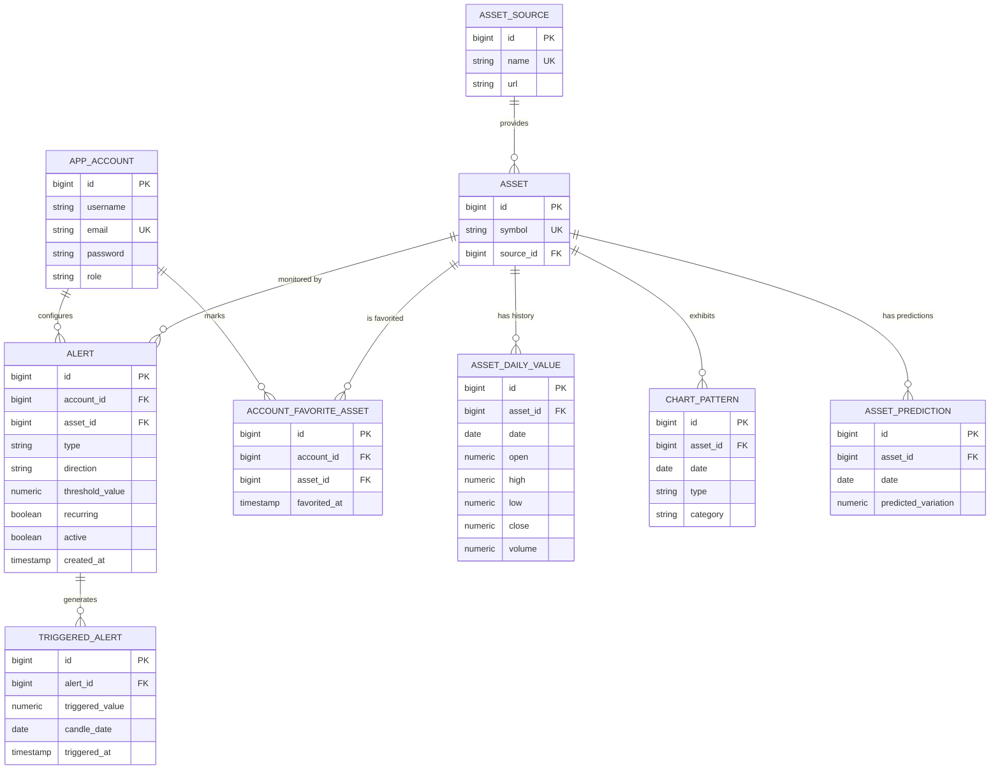

# Schéma de la Base de Données

Ce document décrit la structure de la base de données PostgreSQL utilisée par le Trading Assistant. Le schéma est géré automatiquement par Hibernate (`ddl-auto: update`).

## Diagramme de Relation Entité (ERD)

## Description des Tables

### `app_account`
- `id` (PK) : Identifiant unique (Séquence `account_sequence`).
- `username` : Nom d'affichage de l'utilisateur.
- `email` (UK) : Identifiant de connexion unique (utilisé pour le JWT).
- `password` : Mot de passe haché en BCrypt.
- `role` : Rôle de l'utilisateur (`ROLE_USER`, `ROLE_ADMIN`).

### `asset_source`
- `id` (PK) : Identifiant unique (Séquence `asset_source_sequence`).
- `name` (UK) : Nom logique de la source (ex: `hyperliquid`).
- `url` : URL de base de l'API de données.

### `asset`
- `id` (PK) : Identifiant unique (Séquence `asset_sequence`).
- `symbol` (UK) : Symbole boursier de l'actif (ex: `BTC`, `ETH`).
- `source_id` (FK) : Référence vers la source de données.

### `asset_daily_value`
- `id` (PK) : Identifiant unique (Séquence `asset_daily_value_sequence`).
- `asset_id` (FK) : Référence vers l'actif.
- `date` : Date de la bougie journalière.
- **Contrainte :** Une seule bougie autorisée par couple (`asset_id`, `date`).
- Les prix (`open`, `high`, `low`, `close`) et le `volume` utilisent `NUMERIC(30,10)` pour une précision financière optimale.

### `alert`
- `id` (PK) : Identifiant unique (Séquence `alert_sequence`).
- `account_id` (FK) : Propriétaire de l'alerte.
- `asset_id` (FK) : Actif surveillé.
- `type` : Type de condition (`PRICE_THRESHOLD`, `VOLUME_THRESHOLD`).
- `direction` : Sens de comparaison (`ABOVE` pour >=, `BELOW` pour <=).
- `threshold_value` : Seuil configuré par l'utilisateur.
- `recurring` : Si `true`, l'alerte reste active après déclenchement.
- `active` : Si `false`, l'alerte est ignorée par le système d'évaluation.

### `triggered_alert`
- `id` (PK) : Identifiant unique (Séquence `triggered_alert_sequence`).
- `alert_id` (FK) : Référence vers l'alerte déclenchée.
- `triggered_value` : La valeur réelle (prix ou volume) qui a provoqué le déclenchement.
- `candle_date` : La date de la bougie responsable du déclenchement.
- `triggered_at` : Date et heure de détection par le système.
- **Contrainte :** Une alerte ne peut se déclencher qu'une seule fois pour une date de bougie donnée (`UK(alert_id, candle_date)`).

### `account_favorite_asset`
- `id` (PK) : Identifiant unique (Séquence `account_favorite_asset_sequence`).
- `account_id` (FK) : Utilisateur ayant mis l'actif en favori.
- `asset_id` (FK) : L'actif mis en favori.
- `favorited_at` : Horodatage de l'ajout en favori.
- **Contrainte :** Un utilisateur ne peut mettre un actif en favori qu'une seule fois (`UK(account_id, asset_id)`).

### `chart_pattern`
- `id` (PK) : Identifiant unique (Séquence `chart_pattern_sequence`).
- `asset_id` (FK) : Référence vers l'actif.
- `date` : Date à laquelle la figure a été détectée.
- `type` : Le nom de la figure chartiste (ex: `BULLISH_ENGULFING`, `DOJI`).
- `category` : La catégorie de la figure (`BULLISH`, `BEARISH`, `NEUTRAL`).
- **Contrainte :** Une même figure ne peut être détectée qu'une seule fois pour un actif à une date donnée (`UK(asset_id, date, type)`).

### `asset_prediction`
- `id` (PK) : Identifiant unique (Séquence `asset_prediction_sequence`).
- `asset_id` (FK) : Référence vers l'actif concerné.
- `date` : Date ciblée par la prédiction.
- `predicted_variation` : La variation de prix estimée par l'intelligence artificielle (en pourcentage).
- **Contrainte :** Une seule prédiction autorisée par couple (`asset_id`, `date`) (`UK(asset_id, date)`).
